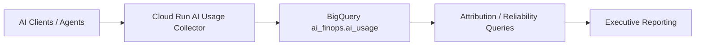

# AI Usage Tracking Platform for Enterprise AI FinOps

## Customer Problem

Enterprises adopting AI services need a reliable way to track usage, attribute costs, and understand the operational impact of AI workloads. Without a standard telemetry pipeline, leaders cannot answer which teams, workflows, or agents are driving spend or reliability risk.

## Architecture

The platform combines Terraform, Cloud Build, Artifact Registry, Cloud Run, IAM, and BigQuery to create a secure and repeatable AI FinOps pipeline.

## Implementation Approach

- Build the collector as a small Cloud Run service.
- Use Terraform to provision the service account, repository, IAM bindings, and runtime settings.
- Store normalized telemetry in the `ai_finops.ai_usage` table.
- Keep public access disabled by default.
- Use structured logging and health/readiness endpoints for operations.

## Outcomes

- Centralized AI usage visibility
- Cost attribution by team, project, workflow, and agent
- Reliability signals alongside cost data
- Secure-by-default enterprise deployment model
- Repeatable build and teardown workflow

## Business Benefits

- Reduces AI spend ambiguity
- Improves budget accountability
- Enables chargeback and showback models
- Gives engineering and leadership a shared source of truth
- Creates a path to executive dashboards and optimization insights

## Consulting Engagement Model

1. Discovery and AI FinOps assessment
2. Platform architecture and Terraform design
3. Collector deployment and validation
4. Operational handoff and runbook creation
5. Executive reporting and dashboard roadmap

This use case is a consulting-ready foundation for enterprise AI FinOps conversations.

## Related Documentation
- [Case Study #003](../../docs/case-studies/case-study-003-ai-finops-foundation.md)
- [Case Study #004](../../docs/case-studies/case-study-004-ai-usage-collector-platform.md)
- [AI Usage Collector Runbook](../../runbooks/ai-usage-collector-deployment-and-troubleshooting.md)
- [AI FinOps Architecture](../../docs/architecture/ai-finops/AI_FINOPS_ARCHITECTURE.md)
