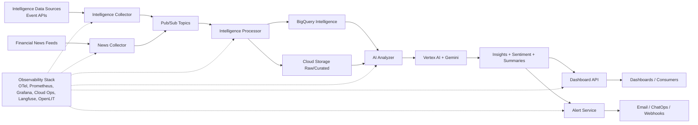
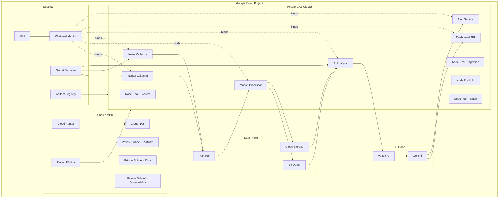
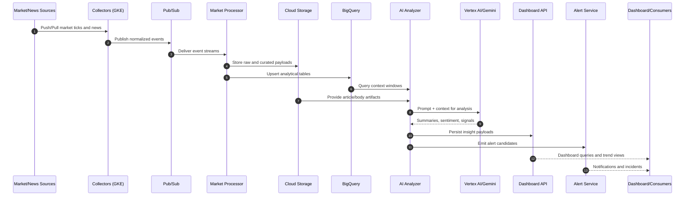
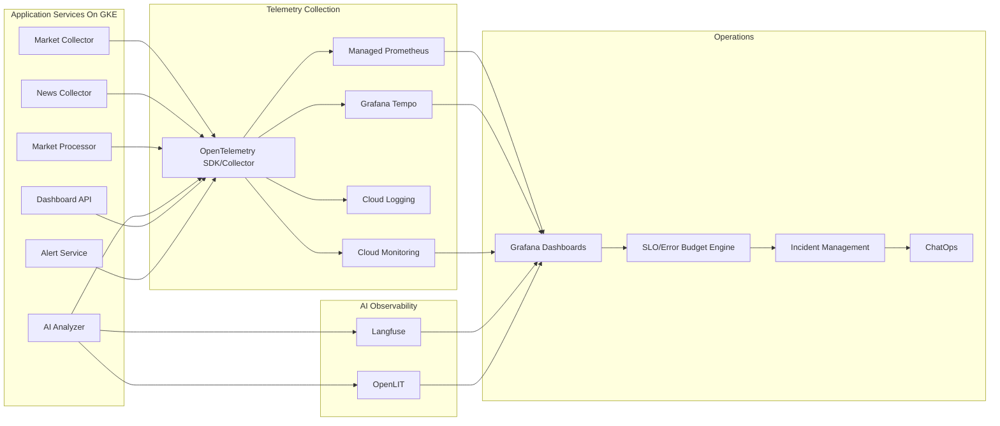
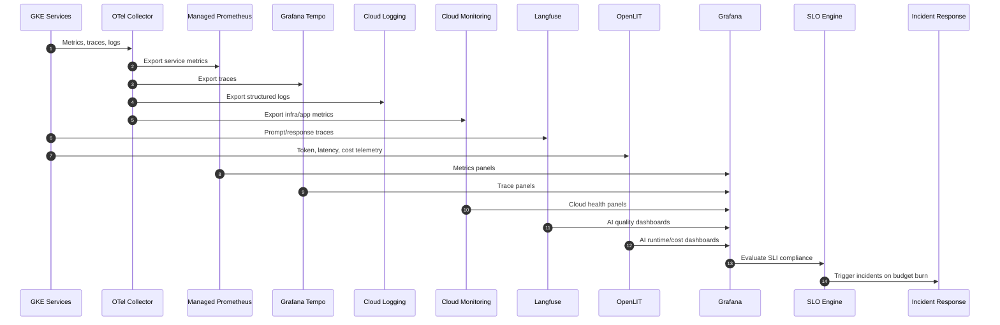

# AiOpsVista Intelligence Platform - Architecture Blueprint

Version: 1.0  
Date: 2026-06-02  
Authors: Principal Cloud Architect, Staff SRE, AI Platform Architect

## 0. Scope And Intent

This document defines the complete architecture blueprint for the AiOpsVista Intelligence Platform on Google Cloud Platform.

This deliverable is documentation-only and intentionally excludes Terraform implementation code.

## 1. Executive Architecture

### 1.1 Executive Summary

AiOpsVista Intelligence Platform is a production-style, AI-powered intelligence system built on GCP. It continuously ingests signal data, operational events, and financial news, processes and enriches the data, applies LLM-powered analysis, and exposes actionable insights through APIs, alerts, and dashboards.

The platform is engineered to demonstrate enterprise practices across:

- Cloud architecture and landing zone design
- Kubernetes platform engineering
- Site Reliability Engineering with SLOs and error budgets
- End-to-end observability and AI observability
- AI engineering and operational AI reliability
- Agent-oriented operational workflows

It is designed for four outcomes:

1. Portfolio-grade demonstration project
2. Hands-on learning platform
3. Consulting showcase for enterprise conversations
4. Reusable reference architecture for AiOpsVista offerings

### 1.2 Business Architecture

Core business capabilities:

1. Intelligence Data Ingestion: real-time and periodic event collection
2. News Intelligence: news ingestion, normalization, and sentiment enrichment
3. AI Insight Generation: summarization, signal extraction, and anomaly interpretation
4. Delivery Channels: dashboard APIs, alerting, and executive-ready reporting
5. Reliability Management: SLI/SLO monitoring and AI quality governance

### 1.3 High-Level Component Diagram



### 1.4 Executive Narrative

The architecture separates ingestion, processing, AI enrichment, and delivery into independently scalable microservices on private GKE. Pub/Sub decouples producers and consumers for resilience and burst absorption. BigQuery serves analytical workloads while Cloud Storage preserves raw and curated assets. Vertex AI with Gemini powers AI analysis workflows with prompt/version governance. Reliability and AI quality are first-class concerns via OpenTelemetry, Cloud Operations, Managed Prometheus, Grafana, Langfuse, and OpenLIT.

## 2. Platform Architecture (GCP)

### 2.1 Platform Design Principles

- Private-by-default networking and workloads
- Decoupled event-driven architecture for scale and resilience
- Explicit workload identities and least privilege IAM
- Multi-environment isolation with promotion controls
- Full telemetry coverage across infrastructure, application, and AI layers

### 2.2 Networking

- Shared VPC for centralized network governance
- Private subnets per environment and workload tier
- Cloud Router + Cloud NAT for controlled egress
- Firewall rules with explicit east-west and north-south policies
- Private Google access and restricted egress patterns for managed services

### 2.3 Platform

- Private GKE cluster with control plane access restrictions
- Node pools separated by workload class:
	- system-pool
	- ingest-pool
	- ai-pool (higher CPU/RAM and optional GPU profile)
	- batch-pool
- Workload Identity to eliminate long-lived key usage
- Artifact Registry for signed container image lifecycle

### 2.4 Data

- Pub/Sub topics and subscriptions for ingestion and internal eventing
- BigQuery datasets for curated intelligence, features, and reporting
- Cloud Storage buckets for raw feeds, replay archives, and ML artifacts

### 2.5 AI

- Vertex AI as managed AI platform control plane
- Gemini model endpoints for summarization and sentiment tasks
- Model safety, prompt templates, and traceability integrated with AI observability

### 2.6 Security

- IAM role segmentation by service and environment
- Dedicated service accounts per workload
- Secret Manager for API keys, webhook tokens, and model credentials
- Binary authorization and image provenance checks (recommended)

### 2.7 Detailed Platform Architecture Diagram



### 2.8 Data Flow Diagram



## 3. AI Reliability Architecture

### 3.1 AI SRE Goals

- Ensure AI response quality, latency, and availability meet business targets
- Detect model drift, prompt regressions, and inference anomalies early
- Tie AI quality incidents to operational incident response workflows

### 3.2 Observability Stack

- OpenTelemetry: traces, metrics, logs across all services
- Managed Prometheus: metrics scraping and retention
- Grafana: unified dashboards and SLO visualizations
- Grafana Tempo: distributed tracing backend
- Cloud Monitoring: GCP-native infra health and alerting
- Cloud Logging: centralized logs and audit trails

### 3.3 AI Observability Stack

- Langfuse: LLM traces, prompt versions, quality feedback loops
- OpenLIT: LLM token/cost/latency instrumentation and AI runtime telemetry

### 3.4 Reliability Model

Primary AI service-level indicators:

- Insight API availability
- End-to-end insight generation latency
- AI response correctness acceptance score
- Alert precision and recall proxy metrics
- Data freshness lag for market and news streams

SLO model:

- 99.9% monthly availability for Dashboard API
- P95 insight generation latency less than 8 seconds
- 99% data ingestion freshness within 60 seconds
- AI quality acceptance greater than or equal to 95% on curated evaluation sets

Error budgets are consumed by failed requests, latency breaches, stale data breaches, and AI quality regressions.

### 3.5 AI SRE Architecture Diagram



### 3.6 Telemetry Flow Diagram



## 4. Application Microservices Design

### 4.1 Market Collector

- Responsibilities:
	- Poll/stream top 10 US stocks prices and market events
	- Normalize source payloads into internal schema
	- Publish events to Pub/Sub
- APIs:
	- Internal health endpoints: /healthz, /readyz
	- Optional admin endpoint: /sources/reload
- Inputs:
	- Exchange/market API feeds
- Outputs:
	- market.prices topic
	- market.events topic
- Scaling considerations:
	- Horizontal scaling by symbol partitioning
	- Backoff and retry with dead-letter handling

### 4.2 Market Processor

- Responsibilities:
	- Consume market/news events
	- Enrich, deduplicate, validate, aggregate windows
	- Persist to BigQuery and Cloud Storage
- APIs:
	- Internal job trigger endpoint: /process/window
- Inputs:
	- Pub/Sub market and news topics
- Outputs:
	- Curated BigQuery tables
	- Curated objects in Cloud Storage
- Scaling considerations:
	- Consumer autoscaling on queue depth and lag
	- Idempotent processing and replay support

### 4.3 News Collector

- Responsibilities:
	- Ingest financial news feeds
	- Parse, clean, classify source metadata
	- Publish canonical news events
- APIs:
	- Internal endpoint: /ingest/news
- Inputs:
	- RSS/API/news vendor feeds
- Outputs:
	- news.raw topic
	- news.normalized topic
- Scaling considerations:
	- Burst handling during high-volatility market events
	- Source-specific circuit breakers

### 4.4 AI Analyzer

- Responsibilities:
	- Build prompt context from market + news data
	- Invoke Gemini through Vertex AI
	- Generate summaries, sentiment, and risk signals
	- Emit quality metadata and trace data
- APIs:
	- Internal endpoint: /analyze/batch and /analyze/realtime
- Inputs:
	- BigQuery context windows
	- Cloud Storage news artifacts
- Outputs:
	- insight.generated topic
	- ai.analysis BigQuery tables
	- Langfuse/OpenLIT telemetry
- Scaling considerations:
	- Throttle by model quotas and cost controls
	- Separate low-latency and batch inference lanes

### 4.5 Dashboard API

- Responsibilities:
	- Serve insights, trends, sentiment, and reliability KPIs
	- Enforce API authN/authZ and rate limits
- APIs:
	- GET /v1/markets
	- GET /v1/insights
	- GET /v1/sentiment
	- GET /v1/reliability/slo
- Inputs:
	- BigQuery views and cached aggregates
- Outputs:
	- JSON APIs for dashboards and downstream clients
- Scaling considerations:
	- HPA on request rate and latency
	- Cache hot queries and shard by tenant/workspace when needed

### 4.6 Alert Service

- Responsibilities:
	- Evaluate alert rules from market + AI signals
	- Route incidents to email, chat, webhook channels
	- Integrate with incident workflow
- APIs:
	- POST /v1/alerts/test
	- GET /v1/alerts/policies
- Inputs:
	- insight.generated topic
	- SLO burn-rate alerts
- Outputs:
	- Notification events and incident tickets
- Scaling considerations:
	- Prioritized queue for critical alerts
	- De-duplication and suppression windows

## 5. Repository Structure

Recommended multi-repo or mono-repo top-level layout:

```text
aiopsvista-intelligence/
├── platform-terraform/
│   ├── modules/
│   ├── environments/
│   │   ├── dev/
│   │   ├── stage/
│   │   └── prod/
│   ├── policies/
│   └── README.md
├── intelligence-services/
│   ├── intelligence-collector/
│   ├── intelligence-processor/
│   ├── news-collector/
│   ├── ai-analyzer/
│   ├── dashboard-api/
│   ├── alert-service/
│   ├── shared-libs/
│   └── ci/
├── observability-stack/
│   ├── grafana/
│   ├── prometheus/
│   ├── tempo/
│   ├── otel/
│   ├── langfuse/
│   ├── openlit/
│   └── slos/
└── documentation/
		├── architecture/
		├── runbooks/
		├── adrs/
		├── diagrams/
		└── tutorials/
```

## 6. AI Usage Collector Completion

AiOpsVista now includes a completed AI Usage Collector platform for Enterprise AI FinOps.

### 6.1 Delivered Capability

- Cloud Run AI Usage Collector service
- Artifact Registry image pipeline
- Terraform-managed IAM and runtime controls
- BigQuery `ai_finops.ai_usage` integration
- Secure-by-default authenticated access
- Health, readiness, and structured logging controls

### 6.2 Architecture References

- [AI Usage Collector Executive View](../architecture/executive-view.md)
- [AI Usage Collector Platform Architecture](../architecture/platform-architecture.md)
- [AI Usage Collector SRE View](../architecture/ai-sre-architecture.md)

### 6.3 Roadmap Position

This capability completes the Collect phase in the AiOpsVista maturity chain and prepares the repository for Case Study #005: AI FinOps Analytics & Executive Dashboard.

## 6. Deployment Roadmap

### Phase 1: Landing Zone

- Goals:
	- Establish org/project baseline, IAM guardrails, billing controls
- Deliverables:
	- Project hierarchy, baseline IAM, logging/audit policies
- Success criteria:
	- Security baseline approved, audit logs enabled, budget alerts active

### Phase 2: Shared VPC

- Goals:
	- Create secure network foundation for all environments
- Deliverables:
	- Shared VPC, private subnets, NAT, firewall policy set
- Success criteria:
	- Private workload connectivity validated with controlled egress

### Phase 3: GKE

- Goals:
	- Stand up private Kubernetes platform for microservices
- Deliverables:
	- Private GKE cluster, node pools, Workload Identity, Artifact Registry
- Dev/demo profile:
	- Cost-optimized node disks, a single e2-small system pool, and the application pool disabled for phase 1
- Success criteria:
	- Core services deploy successfully with policy-compliant identities

### Phase 4: Observability

- Goals:
	- Implement infrastructure and app telemetry baseline
- Deliverables:
	- OTel collectors, Prometheus, Grafana, Cloud Ops dashboards
- Success criteria:
	- Golden signals visible for all services with actionable alerts

### Phase 5: Intelligence Data

- Goals:
	- Deliver reliable ingestion and processing pipeline for intelligence data
- Deliverables:
	- Intelligence Collector, Processor, Pub/Sub streams, BigQuery tables
- Success criteria:
	- Data freshness SLI achieved and replay pipeline validated

### Phase 6: AI

- Goals:
	- Introduce AI analysis and summarization workflows
- Deliverables:
	- AI Analyzer, Vertex AI/Gemini integration, insight APIs
- Success criteria:
	- Insight latency and quality meet initial SLO thresholds

### Phase 7: Reliability

- Goals:
	- Operationalize SLOs, error budgets, and incident response
- Deliverables:
	- SLI/SLO definitions, burn-rate alerting, reliability runbooks
- Success criteria:
	- Error budget policy used for release governance

### Phase 8: Agent Operations

- Goals:
	- Add agentic operations for triage, diagnosis, and reporting
- Deliverables:
	- Incident triage agent patterns, summarized postmortem workflows
- Success criteria:
	- Mean time to detect and diagnose reduced with measurable trend

## 7. Architecture Decision Records (ADRs)

### ADR-001: Why GKE

- Decision:
	- Use private GKE as primary application runtime platform.
- Rationale:
	- Strong ecosystem, autoscaling, workload isolation, mature operations.
- Consequences:
	- Requires Kubernetes operational discipline and platform engineering maturity.

### ADR-002: Why BigQuery

- Decision:
	- Use BigQuery as analytical warehouse for intelligence and AI outputs.
- Rationale:
	- Serverless analytics, excellent performance for time-series and aggregations.
- Consequences:
	- Requires cost governance for large scans and query optimization practices.

### ADR-003: Why Pub/Sub

- Decision:
	- Use Pub/Sub for event-driven decoupling between ingestion and processing.
- Rationale:
	- High-throughput messaging, replay capability, and fault isolation.
- Consequences:
	- Requires schema/version discipline and subscriber lag monitoring.

### ADR-004: Why OpenTelemetry

- Decision:
	- Standardize telemetry instrumentation on OpenTelemetry.
- Rationale:
	- Vendor-neutral observability standard with broad tooling compatibility.
- Consequences:
	- Requires instrumentation consistency and collector operations management.

### ADR-005: Why Langfuse

- Decision:
	- Use Langfuse for AI traceability, prompt governance, and quality analysis.
- Rationale:
	- Purpose-built LLM observability with prompt/version and evaluation support.
- Consequences:
	- Adds AI observability integration and data retention governance needs.

### ADR-006: Why Grafana

- Decision:
	- Use Grafana as unified visualization and SLO operations layer.
- Rationale:
	- Strong support for metrics/traces/logs and executive-friendly dashboards.
- Consequences:
	- Requires dashboard lifecycle management and permission governance.

## 8. Non-Functional Requirements Snapshot

- Availability target: 99.9% Dashboard API monthly uptime
- Performance target: P95 insight pipeline latency under 8 seconds
- Security target: zero static credentials in workloads via Workload Identity
- Cost target: per-environment AI inference budget with threshold alerts
- Compliance target: full auditability for access, model usage, and alerts

## 9. Risks And Mitigations

- Risk: upstream API instability
	- Mitigation: retries, circuit breakers, dead-letter queues, source failover
- Risk: AI response drift
	- Mitigation: evaluation sets, prompt versioning, canary release for AI changes
- Risk: uncontrolled cloud spend
	- Mitigation: budgets, quota enforcement, model routing policies
- Risk: alert fatigue
	- Mitigation: SLO-based paging, suppression policies, periodic rule tuning

## 10. Next Documentation Artifacts

Recommended next documents to complete architecture package:

1. TECH_STACK.md with version-pinned stack matrix
2. EXECUTION_PLAN.md with milestone calendar and ownership model
3. Per-service API contracts and event schema catalog
4. SLO handbook and incident response runbooks

## Related Documentation
- [Documentation Hub](README.md)
- [Case Studies](case-studies/README.md)
- [Evidence](evidence/README.md)
- [Runbooks](../runbooks/README.md)
- [Roadmap](../roadmap/README.md)
- [Executive View](../architecture/executive-view.md)
- [Platform Architecture](../architecture/platform-architecture.md)
