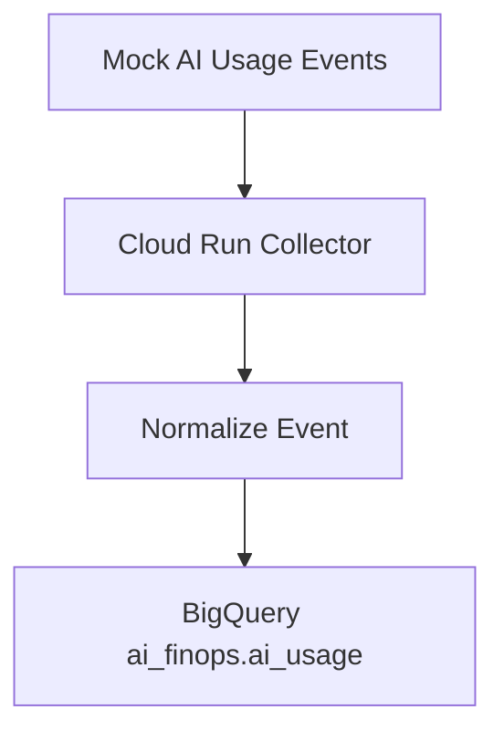

# AI Usage Collector Architecture

## AiOpsVista Intelligence Platform

---

## Executive Summary

Case Study #004 introduces a lightweight AI Usage Collector that converts raw or mock AI usage events into normalized records and writes them into the `ai_finops.ai_usage` BigQuery table created in Case Study #003.

The architecture is intentionally minimal:

- **Cloud Run** hosts a mock collector service
- **BigQuery** stores normalized usage records in `ai_finops.ai_usage`
- **Terraform** provisions and governs the infrastructure

The objective is not to build a full ingestion platform in Phase 1. The objective is to prove that the Case Study #003 data model can be populated reliably, at low cost, and with the right metadata for AI FinOps, AI Observability, AI Reliability Engineering, and Agent Operations.

---

## Business Problem

Organizations already consume AI services across multiple providers and tools:

- OpenAI
- Gemini
- Claude
- GitHub Copilot
- Cursor
- Internal AI agents

Most organizations lack a centralized pipeline to:

- collect AI usage events,
- normalize usage records,
- attribute cost by team, workflow, project, and agent,
- measure reliability outcomes,
- preserve a traceable record for future observability workflows.

Without a collection pipeline, the `ai_usage` table from Case Study #003 remains an empty foundation. Case Study #004 fills that gap with a deliberate Phase 1 design that uses mock data and keeps costs near zero.

---

## Architecture Overview

### Phase 1 Scope

Phase 1 includes only a mock collector. It does **not** call external provider APIs. It generates sample usage events and inserts them into BigQuery so the platform can validate the full data path without external dependencies or variable provider costs.

### Primary Components

| Component | Purpose |
| --- | --- |
| Cloud Run | Runs the mock AI Usage Collector with a small, serverless footprint |
| BigQuery Dataset (`ai_finops`) | Stores AI usage and cost records |
| BigQuery Table (`ai_usage`) | Receives normalized usage events |
| Terraform | Provisions the collector and BigQuery access controls |

---

## Request Flow

1. The mock collector receives a synthetic usage event or generates one internally.
2. The event is normalized to the Case Study #003 schema.
3. Required fields are validated before write:
   - `event_timestamp`
   - `provider`
   - `model`
   - `request_count`
   - `environment`
4. Optional attribution and observability fields are populated when available:
   - `request_id`
   - `user_id`
   - `project_id`
   - `team_name`
   - `workflow_name`
   - `agent_name`
5. Usage and reliability metrics are derived or preserved:
   - `input_tokens`
   - `output_tokens`
   - `total_tokens`
   - `estimated_cost`
   - `latency_ms`
   - `status`
6. The normalized record is written to `aiopsvista-market-dev.ai_finops.ai_usage`.

---

## Normalization Strategy

The normalization layer is intentionally simple and deterministic.

### Input Shape

The collector can accept a loosely structured event that may contain provider-specific metadata or partial attribution data.

### Normalization Rules

- Standardize provider names to a canonical lowercase format.
- Preserve `request_id` if provided; generate one if missing.
- Map team, workflow, and agent metadata into the schema without transformation unless required for canonicalization.
- Convert token and cost values to numeric types before write.
- Default `request_count` to `1` for single-event records.
- Default `status` to `success` for mock happy-path events unless a failure scenario is being exercised.
- Preserve `environment` as a required deployment dimension.

### Why This Matters

A lightweight normalization step is enough to prove the data model. It avoids premature complexity such as streaming pipelines, message brokers, or ETL orchestration. The collector should behave more like a disciplined adapter than a full integration platform.

---

## Cost Attribution Strategy

Case Study #003 established the schema; Case Study #004 proves that schema can be populated with attribution-ready data.

### Attribution Fields

| Field | Purpose |
| --- | --- |
| `team_name` | Team, department, or business unit attribution |
| `workflow_name` | Use-case or workflow attribution |
| `project_id` | Project-level attribution and chargeback |
| `agent_name` | Agent-level attribution for agent operations |
| `user_id` | Human or service identity attribution |
| `request_id` | Event-level correlation for debugging and audit |

### Attributed Questions the Pipeline Enables

- Which team is driving the highest AI spend?
- Which workflow produces the most expensive requests?
- Which agent has the highest failure cost?
- Which project or environment is producing the highest AI consumption?

The collector does not calculate chargeback itself in Phase 1. It ensures the right fields are captured so downstream SQL in BigQuery can answer the attribution questions cleanly.

---

## Reliability Considerations

The collector must support AI Reliability Engineering even though it is initially mock-only.

### Reliability Fields

- `status` captures outcome: `success`, `error`, `timeout`, `rate_limited`, `cancelled`
- `latency_ms` captures end-to-end response time
- `request_id` supports trace correlation and incident investigation

### Reliability Use Cases

- success rate calculations,
- error rate calculations,
- cost of failed requests,
- latency trend analysis,
- provider or workflow reliability comparisons.

### Design Principle

The collector should never drop reliability metadata just because the request is a mock or the provider integration is not yet live. The schema should be populated as if the platform were already production-grade.

---

## Security Controls

The architecture is designed to stay secure without increasing operational burden.

- **No provider keys in Phase 1.** The mock collector does not require OpenAI, Gemini, or Claude credentials.
- **Least privilege BigQuery access.** The Cloud Run service account should receive write access only to `ai_finops.ai_usage`.
- **Workload Identity / service account impersonation patterns.** Avoid long-lived credentials wherever possible.
- **Project scoping.** All resources stay inside the existing `aiopsvista-market-dev` project boundary.
- **Terraform-managed IAM.** Access should be codified and reviewable.

---

## Recommended Terraform Architecture

The implementation should remain lightweight and low-cost.

### Suggested Modules

| Module | Purpose |
| --- | --- |
| `cloud-run-ai-usage-collector` | Deploys the mock collector service |
| `bigquery-ai-finops` | Already established in Case Study #003 |
| `project` | Enables APIs required by Cloud Run and BigQuery |

### Suggested Resources

- `google_cloud_run_v2_service`
- `google_project_iam_member` or dataset/table IAM bindings
- `google_service_account` for the Cloud Run runtime identity
- Optional: `google_storage_bucket` only if sample payloads or artifacts need durable storage

### Design Constraints

- No GKE
- No Pub/Sub
- No Kafka
- No Dataflow
- No Vertex AI
- No complex orchestration

Cloud Run is the correct Phase 1 runtime because it is simple, serverless, and sufficient for a mock collector.

---

## Validation Strategy

Validation should prove the pipeline end to end without introducing unnecessary cost.

### Functional Validation

- Deploy the mock collector
- Generate sample usage events
- Write records to `ai_finops.ai_usage`
- Query the table to confirm schema and metadata fidelity

### Data Validation

- Confirm all required fields are populated
- Confirm optional attribution fields are preserved when supplied
- Confirm `status` and `latency_ms` are written for reliability analysis
- Confirm `request_id` is present for traceability

### Terraform Validation

- `terraform init`
- `terraform validate`
- `terraform plan`
- `terraform apply`
- `terraform state list`

### Success Criteria

- Mock collector deploys successfully to Cloud Run
- Sample records are inserted into BigQuery
- The inserted rows match the `ai_usage` schema from Case Study #003
- The pipeline can be destroyed and re-created cleanly through Terraform

---

## Evidence Collection Strategy

Evidence should be gathered in a way that is useful for clients, architecture reviews, and internal governance.

### Evidence to Capture

- Terraform state resources
- Cloud Run service details
- BigQuery dataset and table confirmation
- Sample inserted rows or query results
- Validation command outputs
- Cost and lifecycle observations

### Evidence Principles

- Capture only what is needed to prove the architecture works.
- Prefer CLI and Terraform outputs over manual console screenshots.
- Keep evidence reproducible and tied to the configuration state.
- Avoid storing secrets or provider credentials in evidence artifacts.

---

## Future Expansion

Case Study #004 is intentionally a bridge to future phases.

### Phase 2

Integrate OpenAI usage ingestion.

### Phase 3

Integrate Gemini usage ingestion.

### Phase 4

Integrate Claude usage ingestion.

### Phase 5

Integrate agent framework telemetry and richer governance metadata.

### Phase 6

Add real-time analytics, dashboards, and operational reporting.

This architecture is designed so each phase can expand capability without forcing a redesign of the collector or the storage model.

---

## Success Criteria

Case Study #004 is successful when:

- the mock collector exists and runs on Cloud Run,
- sample AI usage events are inserted into `ai_finops.ai_usage`,
- the inserted rows match the Case Study #003 schema,
- attribution and reliability fields are present and queryable,
- the entire path is Terraform-managed and cost-efficient,
- the platform is ready for provider-specific integrations in future phases.

## Related Documentation
- [Documentation Hub](../../README.md)
- [Case Studies](../../case-studies/README.md)
- [Evidence](../../evidence/README.md)
- [AI Usage Data Model](AI_USAGE_DATA_MODEL.md)
- [AI Usage Collection Roadmap](AI_USAGE_COLLECTION_ROADMAP.md)
